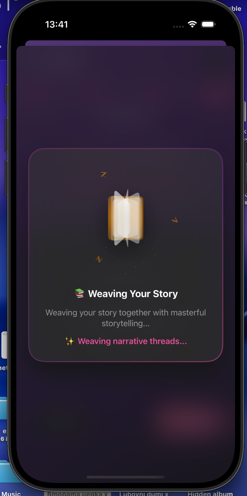
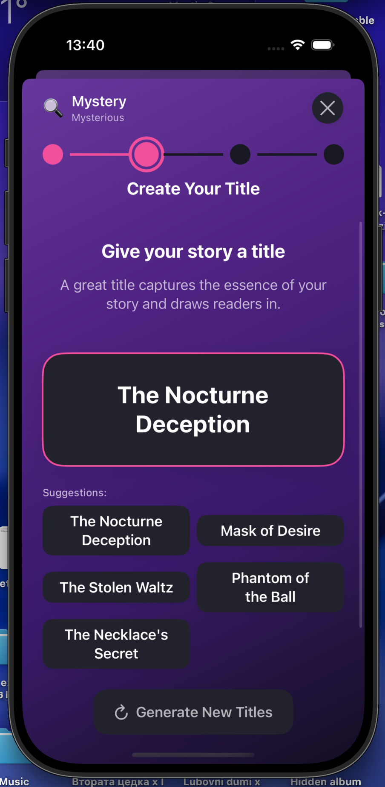
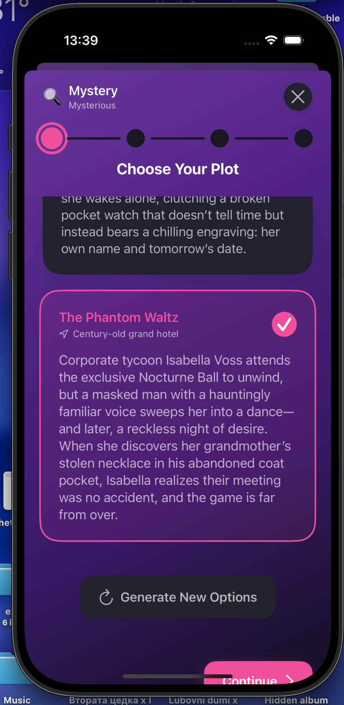
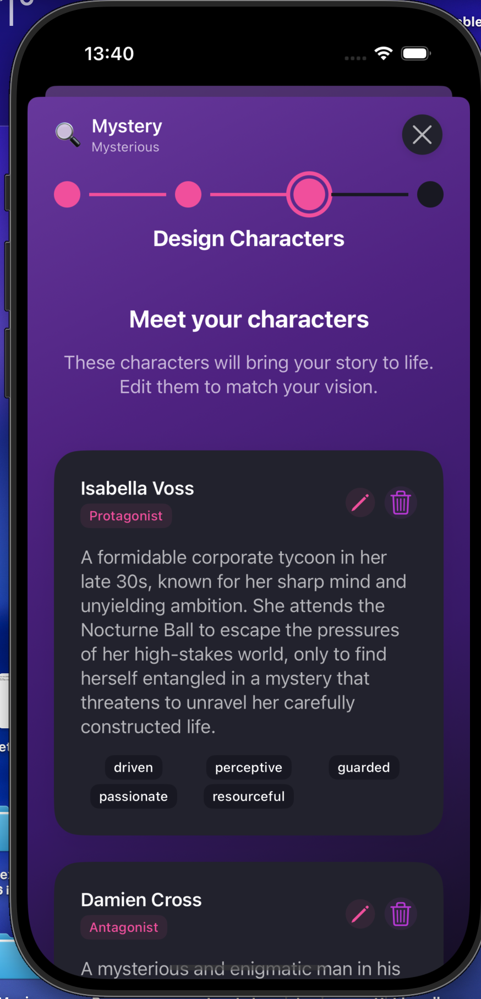
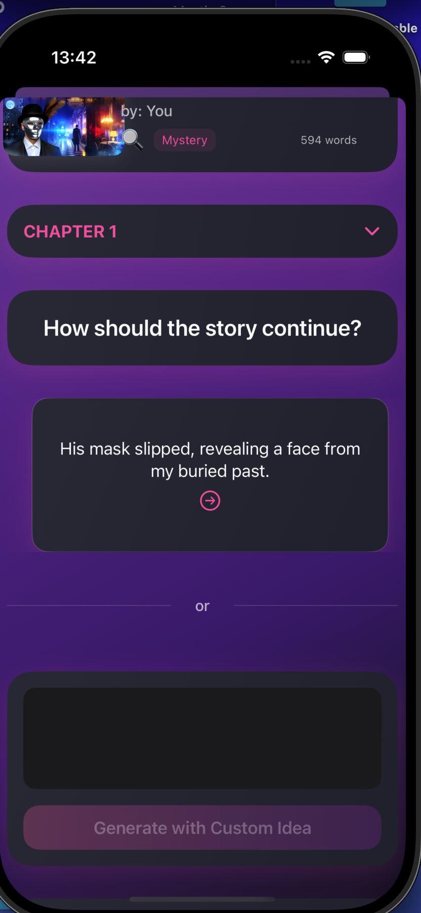
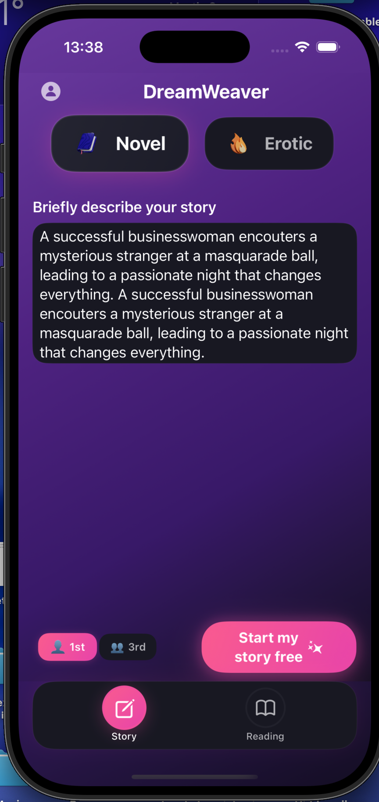
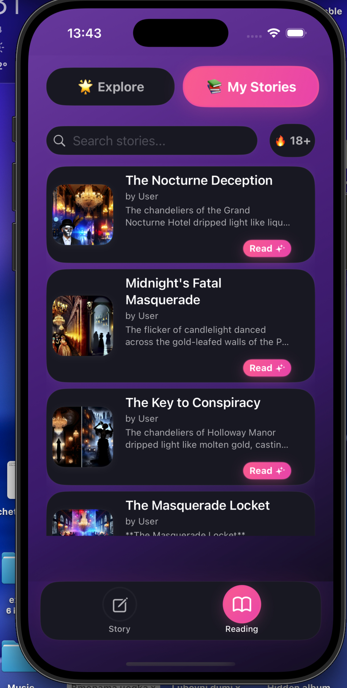

# DreamWeaver iOS App

[](https://swift.org)
[](https://developer.apple.com/ios/)
[](https://developer.apple.com/xcode/swiftui/)
[](LICENSE.md)

A powerful AI-driven story generation app for iOS that empowers users to create compelling narratives with advanced AI technology. Built with SwiftUI, Supabase, OpenRouter DeepSeek for story generation, and OpenAI for cover generation and text-to-speech.

## Screenshots

<div align="center">
  
  
  
</div>

<div align="center">
  
  
  
</div>

<div align="center">
  
</div>

## Features

**AI Story Generation** - Create unique stories using OpenRouter DeepSeek with customizable parameters  
**AI Cover Generation** - Generate stunning story covers using OpenAI's DALL-E  
**Text-to-Speech** - Listen to your stories with OpenAI's advanced TTS technology  
**Story Management** - Save, edit, and organize your stories in your personal library  
**Discover Stories** - Browse and discover stories from the community  
**User Profiles** - Comprehensive profile management with story statistics  
**Modern UI/UX** - Beautiful, intuitive interface with smooth animations  
**Secure Authentication** - Robust user authentication powered by Supabase  
**Native iOS Experience** - Built with SwiftUI for optimal performance and native feel

## Prerequisites

- iOS 16.0 or later
- Xcode 15.0 or later
- Swift 5.9 or later
- Supabase account
- OpenRouter account (for DeepSeek story generation)
- OpenAI API key (for cover generation and TTS)

## Setup Instructions

### 1. Clone the Repository

```bash
git clone https://github.com/BRMilev22/DreamWeaver.git
cd DreamWeaver
```

### 2. Supabase Setup

1. Go to [Supabase](https://supabase.com) and create a new project
2. Once your project is created, go to **Settings** → **API**
3. Copy the following values:
   - **Project URL** (e.g., `https://your-project-id.supabase.co`)
   - **Anon Key** (public key)

### 3. Database Schema Setup

1. Go to your Supabase dashboard
2. Navigate to **SQL Editor**
3. Create a new query and paste the following SQL:

```sql
-- Enable UUID extension
CREATE EXTENSION IF NOT EXISTS "uuid-ossp";

-- Create profiles table
CREATE TABLE IF NOT EXISTS profiles (
    id UUID DEFAULT uuid_generate_v4() PRIMARY KEY,
    user_id UUID REFERENCES auth.users(id) ON DELETE CASCADE,
    email TEXT NOT NULL,
    username TEXT UNIQUE,
    display_name TEXT,
    bio TEXT,
    avatar_url TEXT,
    is_public BOOLEAN DEFAULT true,
    stories_count INTEGER DEFAULT 0,
    followers_count INTEGER DEFAULT 0,
    following_count INTEGER DEFAULT 0,
    created_at TIMESTAMP WITH TIME ZONE DEFAULT timezone('utc'::text, now()) NOT NULL,
    updated_at TIMESTAMP WITH TIME ZONE DEFAULT timezone('utc'::text, now()) NOT NULL
);

-- Create stories table
CREATE TABLE IF NOT EXISTS stories (
    id UUID DEFAULT uuid_generate_v4() PRIMARY KEY,
    user_id UUID REFERENCES auth.users(id) ON DELETE CASCADE,
    title TEXT NOT NULL,
    content TEXT NOT NULL,
    summary TEXT,
    genre TEXT NOT NULL,
    mood TEXT NOT NULL,
    is_published BOOLEAN DEFAULT false,
    is_premium BOOLEAN DEFAULT false,
    likes_count INTEGER DEFAULT 0,
    views_count INTEGER DEFAULT 0,
    words_count INTEGER DEFAULT 0,
    reading_time INTEGER DEFAULT 0,
    generation_prompt TEXT,
    generation_parameters JSONB,
    created_at TIMESTAMP WITH TIME ZONE DEFAULT timezone('utc'::text, now()) NOT NULL,
    updated_at TIMESTAMP WITH TIME ZONE DEFAULT timezone('utc'::text, now()) NOT NULL,
    published_at TIMESTAMP WITH TIME ZONE
);

-- Create indexes
CREATE INDEX IF NOT EXISTS idx_stories_user_id ON stories(user_id);
CREATE INDEX IF NOT EXISTS idx_stories_published ON stories(is_published);
CREATE INDEX IF NOT EXISTS idx_stories_genre ON stories(genre);
CREATE INDEX IF NOT EXISTS idx_stories_created_at ON stories(created_at);
CREATE INDEX IF NOT EXISTS idx_profiles_user_id ON profiles(user_id);
CREATE INDEX IF NOT EXISTS idx_profiles_username ON profiles(username);

-- Enable Row Level Security
ALTER TABLE profiles ENABLE ROW LEVEL SECURITY;
ALTER TABLE stories ENABLE ROW LEVEL SECURITY;

-- Create policies
CREATE POLICY "Public profiles are viewable by everyone" ON profiles FOR SELECT USING (is_public = true);
CREATE POLICY "Users can view their own profile" ON profiles FOR SELECT USING (auth.uid() = user_id);
CREATE POLICY "Users can update their own profile" ON profiles FOR UPDATE USING (auth.uid() = user_id);
CREATE POLICY "Users can insert their own profile" ON profiles FOR INSERT WITH CHECK (auth.uid() = user_id);

CREATE POLICY "Published stories are viewable by everyone" ON stories FOR SELECT USING (is_published = true);
CREATE POLICY "Users can view their own stories" ON stories FOR SELECT USING (auth.uid() = user_id);
CREATE POLICY "Users can insert their own stories" ON stories FOR INSERT WITH CHECK (auth.uid() = user_id);
CREATE POLICY "Users can update their own stories" ON stories FOR UPDATE USING (auth.uid() = user_id);
CREATE POLICY "Users can delete their own stories" ON stories FOR DELETE USING (auth.uid() = user_id);

-- Create functions for updated_at
CREATE OR REPLACE FUNCTION update_updated_at_column()
RETURNS TRIGGER AS $$
BEGIN
    NEW.updated_at = timezone('utc'::text, now());
    RETURN NEW;
END;
$$ language 'plpgsql';

-- Create triggers
CREATE TRIGGER update_profiles_updated_at BEFORE UPDATE ON profiles FOR EACH ROW EXECUTE PROCEDURE update_updated_at_column();
CREATE TRIGGER update_stories_updated_at BEFORE UPDATE ON stories FOR EACH ROW EXECUTE PROCEDURE update_updated_at_column();
```

4. Execute the query to create the database schema

### 4. Configure App Settings

1. Open `dreamweaver2.0/dreamweaver2.0/Config/AppConfig.swift`
2. Update the configuration with your API credentials:

```swift
// Replace with your actual credentials
static let supabaseURL = "https://your-project-id.supabase.co"
static let supabaseAnonKey = "your-anon-key-here"
static let openRouterAPIKey = "your-openrouter-api-key"
static let openAIAPIKey = "your-openai-api-key"
```

### 5. Add Supabase Dependencies

1. Open the project in Xcode
2. Go to **File** → **Add Package Dependencies**
3. Add the following URL: `https://github.com/supabase/supabase-swift.git`
4. Choose version `2.0.0` or later
5. Add the `Supabase` product to your target

### 6. Build and Run

1. Select your target device (iOS Simulator or physical device)
2. Press **Cmd+R** to build and run the app
3. The app should launch and show the authentication screen

## Usage

### Creating Your First Story

1. **Sign Up** - Create a new account or sign in with existing credentials
2. **Navigate to Create** - Tap the "Create" tab at the bottom
3. **Enter Prompt** - Describe your story idea in the prompt field
4. **Select Parameters** - Choose genre, mood, and story length
5. **Advanced Settings** (Optional) - Set writing style, characters, setting, etc.
6. **Generate** - Tap "Generate Story" to create your story
7. **Edit & Save** - Review the generated story and save it

### Discovering Stories

1. **Browse** - Use the "Discover" tab to explore published stories
2. **Search** - Use the search bar to find specific stories
3. **Filter** - Filter by genre using the category chips
4. **Read** - Tap on any story card to read it

### Managing Your Stories

1. **My Stories** - View all your created stories in the "My Stories" tab
2. **Edit** - Tap "Edit" on any story to modify it
3. **Publish** - Toggle the publish status to share stories publicly
4. **Delete** - Remove stories you no longer want

## Architecture

The app follows a clean architecture pattern:

- **Models** - Data structures for User, Story, and related entities
- **Views** - SwiftUI views for the user interface
- **Services** - Business logic and API communication
- **Config** - App configuration and settings

## API Integration

### OpenRouter DeepSeek

The app uses OpenRouter's DeepSeek model for story generation:
- **Model**: DeepSeek via OpenRouter API
- **API**: REST API with JSON requests
- **Configuration**: Customizable temperature, max tokens, and prompts
- **Cost-effective**: Optimized for high-quality story generation

### OpenAI

Multiple OpenAI services for enhanced storytelling:
- **DALL-E**: AI-generated story covers and illustrations
- **Text-to-Speech**: High-quality audio narration of stories
- **API**: REST API integration with secure key management

### Supabase

Database and authentication powered by Supabase:
- **Authentication**: Email/password with user profiles
- **Database**: PostgreSQL with Row Level Security
- **Real-time**: Support for real-time updates (future feature)

## Security

- **Row Level Security** - Database-level security policies
- **API Key Protection** - Secure API key management
- **Authentication** - Supabase Auth for user management
- **Data Validation** - Input validation and sanitization

For security issues, please see [SECURITY.md](SECURITY.md).

## Customization

### Themes and Styling

- Modify `AppConfig.swift` for app-wide settings
- Update colors in `Assets.xcassets`
- Customize UI components in individual view files

### Story Generation

- Adjust prompts in `OpenRouterService.swift`
- Modify generation parameters in `StoryGenerationParameters`
- Add new genres or moods in the respective enum types
- Customize cover generation prompts in `OpenAIService.swift`
- Configure TTS voice settings and parameters

## Troubleshooting

### Common Issues

1. **Build Errors**
   - Make sure all dependencies are properly added
   - Check that your iOS deployment target is 16.0 or later

2. **Authentication Issues**
   - Verify Supabase URL and keys are correct
   - Check that your Supabase project is active

3. **Story Generation Fails**
   - Ensure OpenRouter API key is valid and has sufficient credits
   - Check network connectivity
   - Verify DeepSeek model availability

4. **Cover Generation Issues**
   - Verify OpenAI API key is valid
   - Check DALL-E API quota and usage limits
   - Ensure image generation prompts are appropriate

5. **TTS Not Working**
   - Confirm OpenAI API key has TTS access
   - Check audio permissions on device
   - Verify text length is within TTS limits

### Getting Help

- Check the iOS simulator console for error messages
- Verify your Supabase project settings
- Review the database schema in Supabase dashboard

## License

This project is licensed under the MIT License - see the [LICENSE.md](LICENSE.md) file for details.

## Contributing

This is a personal project developed as part of a freelance assignment. While contributions are welcome, please note that all rights and copyright belong to Boris Milev.

For bug reports, feature requests, or questions, please open an issue on GitHub.

## Contact

- **Author**: Boris Milev
- **Email**: zvarazoku9@icloud.com
- **GitHub**: [@BRMilev22](https://github.com/BRMilev22)

## Acknowledgments

- **Supabase** - Backend as a Service platform
- **OpenRouter** - API gateway for accessing DeepSeek and other AI models
- **DeepSeek** - Advanced AI language model for story generation
- **OpenAI** - DALL-E for cover generation and TTS for audio narration
- **SwiftUI** - Modern iOS UI framework
- **Apple Developer Community** - For excellent documentation and resources

---

<div align="center">
  <b>Built with ❤️</b>
  <br>
  <sub>© 2024 Boris Milev. All rights reserved.</sub>
</div> 